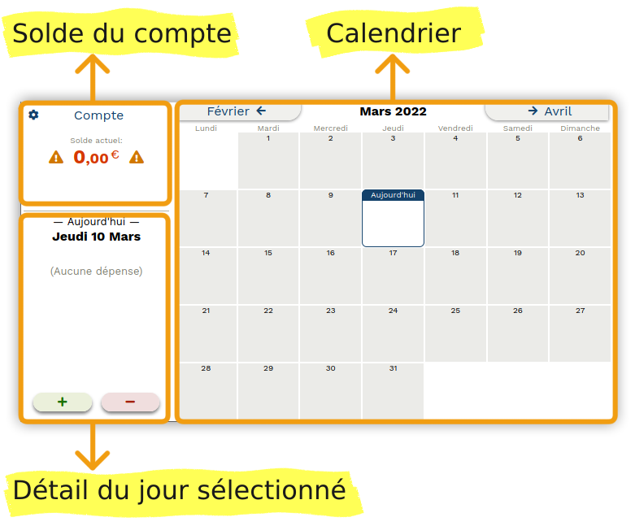

# Utilisation de Pactole

## Présentation générale

La page principale de Pactole est divisée en trois parties:

- à droite: le calendrier;
- en haut à gauche: le solde du compte;
- en dessous du solde: le détail du jour sélectionné dans le calendrier.

## Ajouter le solde initial

Lors de la première utilisation de pactole, vous devez entrer le solde
actuellement disponible sur votre compte.

Pour cela il suffit d'ajouter une nouvelle entrée d'argent à la date
d'aujourd'hui, avec pour montant le solde actuel de votre compte. Vous pouvez y
ajouter une description, par exemple "Solde initial".

Pour savoir comment ajouter une opération, voir la section suivante.

## Ajouter une nouvelle dépense, ou une nouvelle entrée d'argent

1. Dans le calendrier, sélectionnez le jour où vous voulez ajouter une
   opération. Si le mois affiché n'est pas le bon, utilisez les deux boutons en
   haut du calendrier pour changer le mois.

2. Dans la partie de gauche, tout en bas, cliquez sur le bouton "-" si vous
   voulez ajouter une dépense, ou bien sur le bouton "+" si vous voulez ajouter
   une entrée d'argent.

3. Dans la fenêtre de dialogue qui s'ouvre, entrez le montant de l'opération.
   Vous pouvez également entrer une description.

4. Enfin, confirmez l'ajout de l'opération en cliquent sur le bouton "OK".

## Supprimer une dépense, ou une entrée d'argent

1. Dans le calendrier, sélectionnez le jour où se trouve l'opération que vous
   voulez supprimer.

2. Dans la partie de gauche, cliquez sur la ligne correspondant à l'opération.

3. Cliquez sur le bouton "Supprimer".

## Changer le montant ou la description d'une dépense, ou d'une entrée d'argent

1. Dans le calendrier, sélectionnez le jour où se trouve l'opération que vous
   voulez modifier.

2. Dans la partie de gauche, cliquez sur la ligne correspondant à l'opération.

3. Dans la fenêtre de dialogue qui s'ouvre, vous pouvez changer le montant et la
   description.

4. Lorsque vous avez fini, confirmez les changements en cliquant sur le bouton
   "OK".

## Changer la date d'une dépense, ou d'une entrée d'argent

1. Ajouter une nouvelle opération à la date voulue.

2. Supprimer l'ancienne opération.

---
[Retour](index.md)