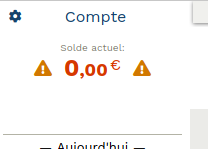
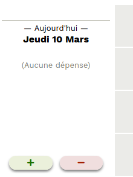

# Utilisation de Pactole

## Présentation générale

La page principale de Pactole est divisée en trois parties.

Dans la partie de droite, un calendrier montre toutes les opérations (dépenses
et entrées d'argent) faites dans le mois. Ce calendrier permet également de
sélectionner un jour, ou de changer le mois affiché.

Dans la partie en haut à gauche, le solde actuel de votre compte est affiché.

Juste en dessous, le jour sélectionné dans le calendrier est affiché, avec le
détail de toutes les opérations faites ce jour là. C'est dans cette partie que
l'on peut ajouter et modifier des opérations.

## Ajouter le solde initial

Lors de la première utilisation de pactole, il faut ajouter le solde
actuellement disponible sur votre compte. Pour cela:

1. Dans le calendrier, vérifier que le mois affiché est bien le mois actuel. Si
   ce n'est pas le cas, choisir le bon mois à l'aide des deux boutons en haut à
   gauche et à droite du calendrier.

2. Toujours dans le calendrier, vérifier que le jour sélectionné correspond bien
   à la date d'aujourd'hui. Si ce n'est pas le cas, sélectionner le bon jour en cliquant dessus.

3. Dans la partie de gauche, tout en bas, cliquer sur le bouton "+".

4. Dans la fenêtre de dialogue qui s'ouvre, entrer la somme actuellement
   disponible sur votre compte.

5. Vous pouvez également entrer une description, par exemple "Solde initial".

6. Enfin, confirmer l'ajout de l'opération en cliquant sur le bouton "OK".

## Ajouter les dépenses et les entrées d'argent

## Modifier ou supprimer une opération

> NOTE: Pour changer la date d'une opération, il faut ajouter une nouvelle
> opération à la date voulue, puis supprimer l'ancienne.

---
[Retour](index.md)